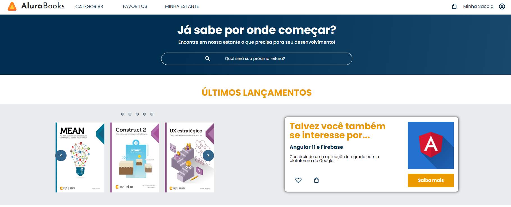

# Plataforma de Livros

Uma aplicação web para exibir e gerenciar uma coleção de livros com detalhes como título, autor, preço e quantidade.

## Interface

<div align="center">
  
</div>

## Sumário

- [Tecnologias Utilizadas](#tecnologias-utilizadas)
- [Status](#status)
- [Descrição](#descrição)
- [Funcionalidades](#funcionalidades)
- [Explicação](#explicação)
- [Estrutura do Projeto](#estrutura-do-projeto)
- [Como Usar](#como-usar)
- [Autor](#autor)

## Tecnologias Utilizadas

<div style="display: flex; flex-direction: row;">
  <div style="margin-right: 20px; display: flex; justify-content: flex-start;">
    
  </div>
  <div style="margin-right: 20px; display: flex; justify-content: flex-start;">
    
  </div>
  <div style="margin-right: 20px; display: flex; justify-content: flex-start;">
    
  </div>
</div>

## Status


## Descrição

A Plataforma de Livros é uma aplicação React que exibe uma lista de livros com detalhes como título, autor, preço e quantidade. Utiliza `styled-components` para estilização e `react-router-dom` para gerenciamento de rotas.

## Funcionalidades

- Exibição de uma lista de livros.
- Detalhes dos livros, incluindo imagem, título, autor e preço.
- Navegação entre as páginas Home e Favoritos.

## Explicação

```jsx
import React, { useState, useEffect } from 'react';

const Livros = () => {
  const [livros, setLivros] = useState([]);

  useEffect(() => {
    fetch('/livros.json')
      .then(response => response.json())
      .then(data => setLivros(data))
      .catch(error => console.error('Erro ao carregar os livros:', error));
  }, []);

  return (
    <div>
      <h1>Livros</h1>
      <ul>
        {livros.map((livro, index) => (
          <li key={index}>
            <h2>{livro.titulo}</h2>
            <p>Autor: {livro.autor}</p>
            <p>Preço: R${livro.preco}</p>
            
          </li>
        ))}
      </ul>
    </div>
  );
};

export default Livros;
```

## Como Usar
Clone o repositório:

git clone https://github.com/usuario/repositorio.git

Navegue até o diretório do projeto:

cd repositorio
Instale as dependências:

npm install
Inicie o servidor de desenvolvimento:

npm start
Acesse a aplicação no navegador: http://localhost:3000

## Autor
Desenvolvido no curso de React da alura